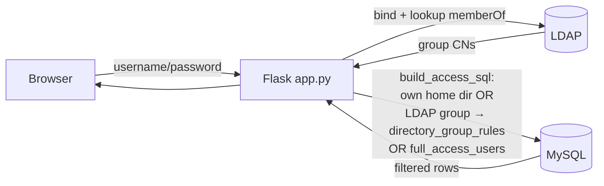
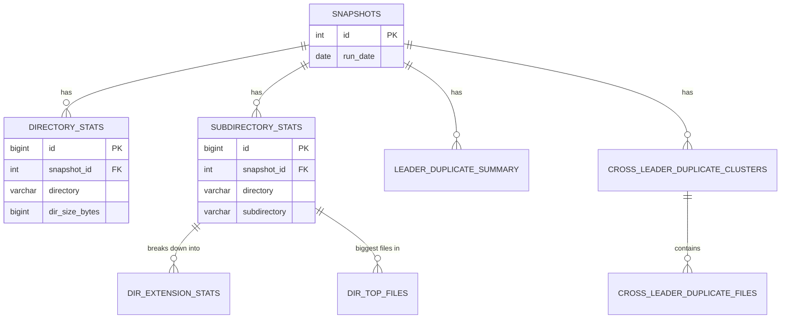

# Diskover Storage Dashboard

Storage tracking for JIC. Directory size and staleness data comes from
two independent sources that feed the same database:

- **Diskover** (monthly, manual) — a web crawler scraped by `diskover_complex.py`,
  giving atime-based staleness (`>1yr`/`>2yr`/`>4yr`) and subdirectory-level size.
- **Isilon SmartQuotas** (daily, automatic) — a JSON dump the storage cluster
  already produces continuously, imported by `import_isilon_daily.py`, giving
  much more frequent (daily) and more accurate top-level directory size, with
  no crawling involved.

Where both cover the same directory, the dashboard shows daily size resolution
with monthly staleness overlaid — see "How trend charts combine both sources"
below.

## Architecture

```
Your laptop                                    Remote VM (v1281)
──────────────────────                         ────────────────────────────────────────
diskover_complex.py                            import_csv.py   ┐
  → runs/<year>/<month>/                         (reads CSVs)  │
      stale_files.csv                                          ├─▶ MySQL ─▶ app.py (Flask)
      area CSVs                                                │    (DB)     (web dashboard)
      subdirectories.csv (if --subdirs, default on)             │
      extension_stats.csv, top_files.csv (if --subdirs          │
        + --file-stats, both default on)                        │
  ──── SCP/rsync ──▶                                            │
                                                                 │
Isilon cluster (writes continuously)                            │
  /isilon_json/daily-json/YYYY/MM/                              │
    JIC-daily-YYYYMMDD.json                                     │
      ──▶ import_isilon_daily.py (daily systemd timer) ─────────┘
```

The diagram above covers how data gets *into* the database. The request
path — how a logged-in user's query gets filtered down to just the
directories they're allowed to see — isn't shown there:



---

## 1. On the remote VM — one-time setup

### 1a. MySQL database

```bash
mysql -u root -p <<EOF
CREATE USER 'diskover'@'localhost' IDENTIFIED BY 'your_password';
CREATE DATABASE diskover_dashboard CHARACTER SET utf8mb4;
GRANT ALL ON diskover_dashboard.* TO 'diskover'@'localhost';
EOF

mysql -u diskover -p diskover_dashboard < schema.sql
```

`schema.sql` creates every table the app needs. `import_csv.py` and
`import_isilon_daily.py` also each auto-create their own newer tables
(`subdirectory_stats`, `isilon_quota_stats`) on first run if `schema.sql`
hasn't been re-applied since they were added, so a fresh deployment or an
older DB both end up in the same state.

### 1b. Python environment

```bash
cd /opt/diskover-dashboard   # or wherever you put the files
python3 -m venv venv
source venv/bin/activate
pip install -r requirements.txt
```

Note: `diskover_complex.py` (the crawler) needs `requests` and
`beautifulsoup4`, which are **not** in `requirements.txt` — it's meant to run
on your own laptop/WSL against the Diskover web UI, not on the server. Only
install those where you actually run the crawler.

### 1c. Secrets — environment variables only, no hardcoded defaults

`config.py` requires `DISKOVER_DB_PASS`, `APP_SECRET_KEY`, and
`LDAP_BIND_USER_PASSWORD` from the environment — it raises immediately at
startup if any are missing, rather than silently falling back to a weak
default. Everything else (hosts, ports, DNs) has a sensible default and can
be left as-is.

Create `/etc/diskover-dashboard.env` from the example and fill in real values:

```bash
sudo install -d -m 750 -o root -g diskover /etc/diskover-dashboard
cp deploy/diskover-dashboard.env.example /etc/diskover-dashboard.env
# generate a real secret key instead of the placeholder:
python3 -c "import secrets; print(secrets.token_hex(32))"
sudo chown root:diskover /etc/diskover-dashboard.env
sudo chmod 640 /etc/diskover-dashboard.env
```

Both `app.py`'s systemd service and `import_isilon_daily.py`'s systemd timer
read this same file via `EnvironmentFile=-/etc/diskover-dashboard.env`. For
running scripts manually in a shell, source it first:

```bash
set -a; source /etc/diskover-dashboard.env; set +a
```

(Consider adding that to `~/.bashrc` for the service account so it's always
available — see comments in `deploy/diskover-dashboard.env.example`.)

---

## 2. Monthly workflow — Diskover crawl (on your laptop)

### Step 1 — run the scraper

```bash
cd ~/diskover
python diskover_complex.py
# → creates runs/<year>/<month>/ (e.g. runs/2026/09/)
#   and writes stale_files.csv + one CSV per storage area there,
#   plus subdirectories.csv (one level into each Groups-type directory —
#   Research Groups / Group Scratch / Archive Groups — on by default;
#   pass --no-subdirs to skip it and speed up the run)
```

On top of `subdirectories.csv`, the same Groups-type step also does a
recursive per-file scan of every subdirectory it finds (`--file-stats`, on by
default) to produce two more CSVs:

- `extension_stats.csv` — exact size + file count per extension, across
  *every* file in that subdirectory (not a sample).
- `top_files.csv` — the 1000 biggest individual files in that subdirectory.

That per-subdirectory scan is the slow part of a run (one recursive file
listing per subdirectory), so it runs `--file-stats-workers` (default `6`)
scans concurrently via a thread pool — raise it for a faster run at the cost
of more concurrent load on Diskover, lower it if Diskover starts erroring
under load. `--no-file-stats` skips this step entirely if you only need
subdirectory sizes. Every HTTP request in this script has a 30s timeout, so a
stalled request fails loudly instead of hanging forever.

Diskover exposes no server-side "sort by size" or "size-by-extension"
endpoint (confirmed by probing — see `--probe-sort`/`--probe-sort-index`,
a diagnostic-only mode that tries a handful of candidate query params against
a real path and prints the results so you can check by eye), so both CSVs
above are computed client-side from one full file listing rather than relying
on an unverified API shortcut.

Before any scraping starts, the script also checks `selectindices.php`
(`get_index_crawl_status()`) to confirm every area's own Diskover index has
actually *finished* its crawl — Diskover registers/names an index as soon as
its crawl **starts**, not once it finishes, so an index can be queried via
`search.php` while still mid-build and silently return partial results with
no error. If any area's index shows a blank "Finish Time" (still crawling)
or couldn't be confirmed at all, the script prints a warning listing which
areas are at risk and asks `Continue anyway? [y/N]` before proceeding — this
is exactly what caught `Group Scratch` being scraped ~23 hours before its
October index had finished indexing. Every log line is now timestamped
(`[HH:MM:SS]`) so a long-running crawl's progress is easy to follow live.

Deep Archive's three root paths (`/peach/deep-archive/groups|platforms|projects`)
each hold a single numbered "shard" directory (e.g. `.../groups/1`) that
transparently contains every real leader/group directory one level deeper —
confirmed directly against a real run's area CSVs, where each root's only
child was a bare digit whose file/folder counts matched the whole area's
totals exactly. `resolve_deep_archive_shard_root()` auto-descends through
this (and, defensively, any further single-child levels, capped at 3) before
listing subdirectories, gated on the **root path** rather than the index
name so it works the same whether Deep Archive is served by its own dated
index or (in `combined_mode`) a single shared index across every area.
Without this, the crawler would treat that one numbered directory as if it
were the only "leader" in the entire area.

### Step 2 — push to the VM

```bash
MONTH=$(date +%Y/%m)
rsync -av ~/diskover/runs/$MONTH/  user@your-vm:/opt/diskover-runs/$(date +%Y-%m)/
```

### Step 3 — import on the VM

```bash
ssh user@your-vm
source /opt/diskover-dashboard/venv/bin/activate
set -a; source /etc/diskover-dashboard.env; set +a

python /opt/diskover-dashboard/import_csv.py \
  /opt/diskover-runs/2026-09 \
  --date 2026-09-01 \
  --notes "September 2026 run"
```

This also imports `subdirectories.csv`, `extension_stats.csv`, and
`top_files.csv` automatically if present in the folder. `dir_top_files` (from
`top_files.csv`) is the one table that **isn't** kept as long-term history —
right after import it's pruned down to just the current + previous month's
snapshots, since it's the bulkiest table (up to 1000 rows per subdirectory
every month). `dir_extension_stats` has no such pruning and accumulates like
everything else.

---

## 3. Daily workflow — Isilon SmartQuotas import (on the VM, automatic)

`import_isilon_daily.py` reads the daily JSON dump Isilon's SmartQuotas
feature already produces (`/isilon_json/daily-json/YYYY/MM/JIC-daily-YYYYMMDD.json`)
and loads it into `isilon_quota_stats`. No crawling, no extra load on the
storage cluster — OneFS tracks this continuously regardless of whether this
importer runs.

```bash
# One specific day:
python import_isilon_daily.py --file /isilon_json/daily-json/2026/09/JIC-daily-20260916.json

# Catch up on everything not yet imported, within the last 31 days (default):
python import_isilon_daily.py --auto

# Backfill one whole calendar year instead:
python import_isilon_daily.py --auto --year 2026

# Catch up on all available history (the folder can hold years of files):
python import_isilon_daily.py --auto --days 0
```

Each day is its own transaction — a corrupt or empty JSON file is skipped and
logged, without rolling back any other day already imported in the same run.

### Automation

```bash
sudo cp deploy/isilon-daily-import.service deploy/isilon-daily-import.timer /etc/systemd/system/
sudo systemctl daemon-reload
sudo systemctl enable --now isilon-daily-import.timer
```

Runs once daily at 01:00 (the JSON files land at 23:50) via `--auto` with the
default 31-day window.

---

## Does this pick up new directories automatically?

Depends which kind of "new directory", and which data source:

**A new directory inside an existing area** (a new PI folder under Research
Groups, a new user under User Homes, a new project under Projects Scratch,
etc.) — auto-discovered, no code changes needed:

- **Diskover crawl**: `list_dirs_at()` re-lists whatever's actually under each
  area root every time it runs, so a new PI folder just shows up in next
  month's `stale_files.csv`/`subdirectories.csv` automatically.
- **The dashboard itself**: fully data-driven — `app.py` always queries
  `SELECT DISTINCT directory ...` from whatever's currently in the DB (group
  leaders, areas, directories), never a hardcoded list. Nothing to touch.
- **Isilon daily import**: caveat — it only picks up a directory if Isilon
  has a SmartQuotas domain on it. User Homes appears to have a "default"
  quota template that auto-provisions new users (the daily JSON includes
  `default-user`/`default-directory` entries), so new users likely appear
  automatically. Whether a brand-new PI folder under Research Groups shows up
  the same way, or needs someone to manually create a quota for it, depends
  on whether that area has the same default-template behavior — worth
  checking with whoever administers the Isilon cluster. Either way, Diskover's
  monthly crawl still covers a directory's size even if Isilon never picks it up.

**A brand-new top-level storage *area*** (not just a new directory inside an
existing one — e.g. an entirely new mount/root the institute starts using) —
this genuinely needs a one-time manual code change: add the new root path to
`INDEX_ROOT_PATHS` in **both** `diskover_complex.py` and
`import_isilon_daily.py` (each keeps its own copy deliberately, rather than
importing from the other — see the comment at the top of
`import_isilon_daily.py` explaining why). That's the only case that isn't
automatic.

---

## 4. Start the web app

```bash
# Development
set -a; source /etc/diskover-dashboard.env; set +a
python app.py

# Production (systemd)
gunicorn -w 2 -b 127.0.0.1:5000 app:app
```

### systemd service

```bash
sudo cp deploy/diskover-dashboard.service /etc/systemd/system/
sudo systemctl daemon-reload
sudo systemctl enable --now diskover-dashboard
sudo systemctl status diskover-dashboard
```

The Gunicorn module path is `app:app`. Keep it bound to `127.0.0.1` if it
sits behind a reverse proxy; use `0.0.0.0` to expose it directly.

---

## Environment variables

Required (no default — `config.py` raises at startup if missing):

| Variable                | Description |
|--------------------------|-------------|
| `DISKOVER_DB_PASS`       | MySQL password |
| `APP_SECRET_KEY`         | Flask session signing key — generate with `python3 -c "import secrets; print(secrets.token_hex(32))"`, never reuse a placeholder |
| `LDAP_BIND_USER_PASSWORD`| LDAP service-account password |

Optional (sensible defaults in `config.py`):

| Variable             | Default              | Description |
|----------------------|-----------------------|-------------|
| `DISKOVER_DB_HOST`    | localhost             | MySQL host |
| `DISKOVER_DB_PORT`    | 3306                  | MySQL port |
| `DISKOVER_DB_USER`    | diskover              | MySQL user |
| `DISKOVER_DB_NAME`    | diskover_dashboard    | Database name |
| `LDAP_HOST`           | nbi.ac.uk             | LDAP host or domain controller |
| `LDAP_PORT`           | 3268                  | LDAP port (3268 for Global Catalog) |
| `LDAP_USE_SSL`        | false                 | true/false |
| `LDAP_BASE_DN`        | DC=nbi,DC=ac,DC=uk    | Search base DN |
| `LDAP_BIND_USER_DN`   | (see config.py)       | Service account DN used for LDAP search |
| `LDAP_ALLOWED_GROUP_DN` | CN=PLAT-Informatics,OU=JICPlatforms,OU=NBIGroups,DC=nbi,DC=ac,DC=uk | Full-access informatics group (admin — not the login gate) |
| `LDAP_REQUIRED_GROUP_DNS` | CN=jic-hpc-group,...;CN=jic-hpc-training,... (semicolon-separated) | **The login gate** — a valid AD account that isn't a member of ANY of these groups is rejected at login, before a session is created |
| `FLASK_DEBUG`         | unset (off)           | Set to `1` to enable Werkzeug's debugger for local development (`python app.py`). Never set this in production — it shows full stack traces and an interactive console on any unhandled exception. Has no effect under gunicorn. |
| `SESSION_COOKIE_SECURE` | unset (off)         | Set to `1`/`true` once the deployment is confirmed to terminate HTTPS in front of the app — forces the session cookie to only be sent over HTTPS. Left off by default since turning it on behind plain HTTP would silently break login (the cookie would never be sent back). |

---

## Pages & features

- **Login** — Active Directory sign-in; a themed cover image and JIC
  Informatics branding, no dashboard access without a valid group membership.
- **Overview** (`/`) — snapshot selector, area filter, summary tiles, storage/stale
  bar charts by area, a sortable/filterable directory table (📈 trend, CSV
  export, PDF report).
- **Area Evolution** (`/evolution`) — Institute / Area / Directory evolution
  line charts, a **year selector** (only years with actual data are offered),
  a directory table for the selected area, and 📂 links into subdirectories
  for Groups-type areas.
- **Group Leader Evolution** (`/group-leader-evolution`) — pick a PI/group
  leader (the dropdown only ever lists leaders you have access to; same
  access model as every other page, not bypassed for this one) to see a
  **storage composition evolution chart**: size stacked by tier (Archive /
  Legacy / Scratch, via `short_area_label()`) rather than by staleness
  threshold, with a metric dropdown (Total size / Stale >1yr / >2yr / >4yr).
  "Total size" merges in daily Isilon data (forward-filled per tier, so a
  tier with no daily feed holds its last monthly value instead of visibly
  dropping to zero between snapshots); the staleness metrics stay
  monthly-only. Below that: a directory table for this leader across every
  tier, and one lazy-loaded chart per directory, same year selector, and a
  "full report" PDF that renders every chart before generating. A leader's
  chart/table scope isn't limited to directories literally named after
  them — it also includes any directory linked to them via an admin-defined
  `directory_group_rules` entry (`leader_scope_sql()` in `app.py`), e.g. a
  Scratch/Projects folder they lead but that isn't under their own named
  directory.
  **Admin-only**: a second chart, "All group leaders combined", same tiered
  breakdown but institute-wide instead of one leader — independently
  access-checked server-side (`/api/all_groups_evolution_by_tier`), not just
  hidden in the UI.
- **Institute Trends** (`/institute-trends`, admin) — institute-wide storage
  stacked by tier (Legacy / Scratch / Archive / Deep Archive), with delta
  tiles showing each tier's change vs. the previous snapshot and an "All
  years" option on top of the usual single-year view. Unlike every other
  trend/evolution chart, the current month is shown as a single collapsed
  point rather than day-by-day.
- **Directory Explorer** (`/directory-explorer`) — one level below a
  Groups-type directory: subdirectory sizes (bar chart colored by relative
  size, table, CSV/PDF export). Only reachable for areas the crawler actually
  collects subdirectory data for; a banner explains that subdirectory size is
  monthly (Diskover) while the parent directory's own total may update daily
  (Isilon), so the two can briefly disagree.
- **Big Files** (`/big-files`) — pick a group leader, then an area, to see a
  "storage composition by file type" doughnut chart (percentage + size per
  extension, `/api/extension_totals`, coloured by the extension action plan —
  see "File-extension action plan" below) and the 1000 biggest individual
  files across every one of that leader's subdirectories in that area
  combined (`/api/top_files`) — not per-subdirectory; see "Biggest files
  across subdirectories" below. A **Folder breakdown** section groups those
  same files by folder (1–3 levels below the leader, adjustable — measured
  forward from the leader's own folder so it stays consistent regardless of
  how deeply any individual file is nested). Both the extension list and the
  folder breakdown let a user mark items "dismissed"/"addressed" — hides them
  from those lists *and* from the biggest-files table, with a toggle to bring
  them back. **Saved to `localStorage` only** — per-browser, not shared
  between users or synced anywhere; there's no server-side record of what's
  been marked. Same access filtering as every other page. A summary tiles row
  (total size, dismissed-extensions size, addressed-folders size, files
  listed) updates live as you dismiss/address things, and each of the three
  cards (composition, folder breakdown, biggest files) can be collapsed with
  a ▾/▸ toggle — also `localStorage`-persisted per browser, so a section you
  don't need stays condensed across reloads. The extension/top-files data
  behind this page is monthly and can lag the current month if that
  leader's file-stats scan hasn't completed yet — when that happens, the
  page falls back to the latest snapshot that actually has data for them
  (`latest_snapshot_with_rows()`) and shows a "Data as of {date}" notice
  (amber when it's showing a past month instead of the current one).
- **Biggest Files** (`/biggest-files?path=...`, reached via the 📄 link on
  Directory Explorer's subdirectory rows) — one subdirectory's own
  size-by-extension chart/table and its own 1000 biggest files, both capped
  to a Top 5/10/20/... view on screen with a "show all"/CSV option that
  always exports the full list regardless of what's currently shown.
- **Duplicate Files** (`/duplicate-files`) — pick a group leader and a size
  tolerance (exact match, or within a %) to cluster likely-duplicate files
  across every directory they have (their own directories plus any linked
  projects, same scope as `leader_scope_sql()` above) by filename and size.
  This is a **heuristic, not a guarantee** — the page carries a prominent
  warning that a filename+size match is not proof of identical content, and
  nothing should be deleted without independently verifying an MD5/SHA
  checksum match first. Not admin-gated, just login-required, same access
  model as every other per-leader page. Each month's import also
  precomputes a lightweight summary (cluster count + reclaimable bytes) per
  leader into `leader_duplicate_summary`, which feeds the admin-only
  "Biggest potential duplicate-file savings" leaderboard card on Growth
  Alerts, so admins don't have to open every leader's page by hand to find
  the biggest wins.
- **Admin** (`/access`, admin) — one page, three tabs sharing the same URL
  prefix's nav entry:
  - **Settings** (`/settings`) — enable/disable which storage areas show up
    in the normal views. This is global — it changes what *every* user sees,
    not just the admin who changed it.
  - **Access Control** (`/access`) — map LDAP group CNs to directory path
    prefixes (with an area-scoped autocomplete drawn from real directory
    paths), and grant specific users full visibility regardless of group.
    Also has **Hidden Group Leaders**: hide a leader from the Storage Alerts & Insights
    duplicate-file leaderboard only, for any reason — it doesn't affect Big
    Files, Duplicate Files's own per-leader page, Group Leader Evolution,
    Area Evolution, Directory Explorer, or Overview, all of which keep
    showing that leader and their data normally. Reversible at any time.
  - **Extension Actions** (`/settings/extensions`) — add/edit/remove the
    category and reasoning behind each extension's 🔴🟡🟢 color on Big
    Files/Biggest Files (see "File-extension action plan" below). Backed by
    the `extension_action_plan` table, seeded once from a built-in starter
    list the first time it's empty; admin edits from then on are the live
    source `classify_extension()` reads.
- **Data Management Guide** (`/data-management`) — storage location advice, good
  habits, metadata, recovering deleted files, sharing data, and a downloadable
  presentation. Unlike every other page, this one and its presentation
  download are **public** (no login required) — it's general JIC data
  management guidance, not anything derived from the dashboard's own storage
  data, so there's no reason to gate it. The nav link shows even on the login
  screen.
- **Storage Alerts & Insights** (`/growth-alerts`, admin — named "Growth
  Alerts" until it grew past just alerts) — four sections:
  - **Notable changes** — flags directories across every enabled storage
    area with a big enough size change (up or down — at least
    `GROWTH_ALERT_THRESHOLD_PCT` **and** `GROWTH_ALERT_THRESHOLD_BYTES`,
    both adjustable from the page itself, or edit the defaults in `app.py`)
    over the last 7 days and/or since the start of the current month — or,
    pick a past year/month to see a single start-vs-end-of-month delta
    instead. Uses Isilon's daily data where available (falling back to the
    earliest day it has that month if data doesn't reach back to the 1st)
    and falls back further to the previous monthly Diskover snapshot when no
    daily data exists at all for a path.
  - **Biggest potential duplicate-file savings** — a leaderboard, system-wide,
    ranked by reclaimable space, built from the summaries `import_csv.py`
    precomputes each month (see Duplicate Files above) and filtered by any
    admin-hidden leaders.
  - **Shared dataset opportunities** (collapsed by default) — the same file
    (by name and size, 10 GB+ floor at precompute time) found under more
    than one *different* group leader, e.g. two groups who've each
    independently downloaded their own copy of the same external dataset —
    unlike the leaderboard above, which only ever looks within one leader's
    own scope. An adjustable 10/25/50 GB minimum-size filter on the page
    narrows the list further (filtered from the precomputed data, not
    recomputed — safe since clustering only ever groups files within 1% of
    each other's size). Precomputed monthly by
    `import_csv.py`'s `compute_and_store_cross_leader_duplicates()`, stored
    in `cross_leader_duplicate_clusters`/`cross_leader_duplicate_files`.
    Same MD5-verification caveat as Duplicate Files — a name+size match is a
    lead to check, not proof.
  - **Most files** — subdirectories with at least a chosen number of
    individual files (▲/▼ steps the minimum by `MOST_FILES_MIN_COUNT_STEP`,
    5,000, default `MOST_FILES_MIN_COUNT_DEFAULT`, 20,000 — lower it to
    surface more directories), ranked by file count (`SUM(file_count)` per
    path from `dir_extension_stats`, computed live, not precomputed — a
    simple aggregate, no clustering involved). For
    spotting directories with an unreasonable number of files independent of
    their total size (millions of tiny files are slow to back up or walk
    regardless of how little space they take up). Same scope limitation as
    everything built on `dir_extension_stats`: only the group-leader
    subdirectories the crawl collects file-stats for. Links to each
    directory's Biggest Files page.

  All four sections can be collapsed independently (▾/▸), and a quick-jump
  nav bar at the top links to each one, expanding "Shared dataset
  opportunities" automatically if it's still collapsed.

### Area naming

Nine areas that fit a "Tier - Category" pattern are relabeled for clarity
(`short_area_label()` in `app.py`): **Legacy / Scratch / Archive / Deep Archive**
× **Groups / Platforms / Projects** (e.g. raw label "JIC-Apricot / Primarydata
Research Groups" displays as "Legacy - Groups" — display-only rename, the
underlying `index_label`/database values are untouched; "Legacy" was "Main"
until this tier was retired as the default for new data). Everything else
(User Homes, Instruments, Informatics Common, HPC Software, Services,
Reference Data) keeps its original label.

One deliberate exception: "JIC-Apricot / Primarydata Platforms" still
displays as **"Main - Platforms"** rather than "Legacy - Platforms". It still
counts toward the Legacy tier in Institute Trends and every other
tier-stacked chart (`tier_bucket_for()`'s `TIER_BUCKET_ALIASES` maps
"Main" → "Legacy"), so this is purely a display-label difference for this
one area, not a separate tier.

### Biggest files across subdirectories

The Big Files page's leader+area biggest-files list doesn't require its own
crawl data — it's a re-sort of what `dir_top_files` already has. Any file
that would rank in the combined top-1000 across several subdirectories is
guaranteed to already be present in its own subdirectory's stored top-1000
row set, since removing files that live in *other* subdirectories can only
improve a file's rank, never hurt it. So `/api/top_files` just fetches every
`dir_top_files` row for that leader+area, re-sorts by size, and takes the top
1000 — no new scan, no new table.

### How trend charts combine both sources

Every trend chart (`createTrendChart()` in `templates/base.html`) shows:

- One point per prior month (its last recorded value), plus every day of the
  current month — keeps a chart spanning months of daily data readable.
- On pages with a year selector, axis labels drop the year (implied by the
  selection); the shared trend-history popup modal (opened via any 📈 link)
  has no selector and shows all available history with full dates instead.
- Size comes from Isilon's daily data where available for that exact
  directory path (more accurate, updated daily); staleness always comes from
  Diskover's monthly crawl. A date with daily size but no matching monthly
  snapshot shows a real gap in the staleness lines rather than a misleading
  drop to zero.
- Every point is also styled by source: **●** solid = a monthly crawl
  snapshot, **○** hollow = a daily Isilon reading, driven by the same
  per-point `monthly` flag (`pointStyleFor()` in `templates/base.html`) used
  everywhere a trend/evolution chart appears, plus a tooltip footer spelling
  it out on hover.

### Loading indicators

Any chart or table backed by a `fetch()` call — Big Files, Group Leader
Evolution, Area Evolution — shows a small spinning "Loading…" badge
(`.loading-badge` in `templates/base.html`, toggled via the shared
`setLoading(id, bool)` helper) next to that section's header while its
request is in flight, cleared in a `finally` block so it never gets stuck
showing on an error.

### Exports

- **CSV** — any sortable table has a "⬇ CSV" button; exports exactly what's
  currently visible (respecting the active filter/sort).
- **PDF report** — "⬇ Download PDF Report" on Overview, Area Evolution, Group
  Leader Evolution, and Directory Explorer bundles the summary tiles and every
  chart on the page into one paginated PDF (`downloadReportPDF()` in
  `templates/base.html`).

### User visibility model

- Logging in at all requires membership in at least one of
  `LDAP_REQUIRED_GROUP_DNS` — a valid AD account that isn't a member of any
  of them is rejected at the login form, no session is created. This is
  checked independently of everything below.
- Informatics users in `LDAP_ALLOWED_GROUP_DN` see everything.
- Users listed in `full_access_users` also see everything.
- Other users only see:
  - directories matched by `directory_group_rules` against their LDAP group CNs
  - their own User Homes directory, matched by username

**Data visibility and admin-page access are separate grants.** The two
bullets above (`can_view_all()` in `app.py`) both unlock seeing every
directory's data, but a `full_access_users` grant on its own does **not**
unlock the admin pages (Settings, Access Control, Extension Actions, Storage
Alerts & Insights, Institute Trends, "All group leaders combined") — those
stay restricted to actual `LDAP_ALLOWED_GROUP_DN` members (`is_admin_user()`).

Manage the visibility rules (not the login gate, which is env-var only) from
the Admin → Access Control tab (`/access`).

### Acting as a group member

Anyone with `can_view_all()` (Informatics admins, or a user granted
`full_access_users`) can preview the dashboard exactly as a real member of
one research group would see it, from a dropdown in the header populated
with known `RG-*` groups (`get_db_group_suggestions()` — a cheap, local-DB
list, not a live LDAP lookup, since this renders on every page view).
Picking one POSTs to `/act-as`, which sets `session["acting_as_group"]`; an
amber banner stays visible on every page while it's active, with a "Stop
acting as" button.

This only ever **narrows** access, never grants anything beyond the real
session's own: `effective_can_view_all()` becomes `False` while acting-as is
set, so `build_access_sql()`, `get_group_leaders()`, and everything built on
them run through the exact same restricted-access code path a real member of
that group would get — using the simulated group alone, not blended with the
real user's own User Homes directory (`effective_username_for_access()`
returns empty while acting-as is active, so the preview isn't contaminated
by the admin's own home directory always being visible on top of it).
Admin-only pages (Settings, Access Control, Storage Alerts & Insights,
Institute Trends) are **not** affected — acting-as only changes what
`can_view_all()`-gated *data* queries return, not `is_admin_user()`.

Session-only (clears on logout), and accepting any group name here —
including one nobody's configured `directory_group_rules` for — carries no
risk: the worst case is an empty, correctly-restricted view, same as a real
user in an unconfigured group would see.

### Stale size calculation

`diskover_complex.py` computes stale size (not just file counts) per
directory, written to `stale_files.csv` as `Stale >1yr/2yr/4yr Bytes` and
stored in `directory_stats.stale_1yr_bytes` etc. For legacy CSVs with only
file *counts*, `import_csv.py` estimates size as:

`stale_size_bytes = dir_size_bytes * (stale_files / total_files)`

---

## Data model

| Table | Written by | Cadence | Notes |
|-------|-----------|---------|-------|
| `snapshots` | `import_csv.py` | monthly | one row per Diskover crawl run |
| `directory_stats` | `import_csv.py` | monthly | one row per top-level directory per snapshot |
| `subdirectory_stats` | `import_csv.py` | monthly | one row per subdirectory (Groups-type areas only), size only |
| `isilon_quota_stats` | `import_isilon_daily.py` | daily | one row per quota'd path per day, size only, independent of `snapshots` |
| `dir_extension_stats` | `import_csv.py` | monthly | one row per extension per subdirectory per snapshot — exact size + count across every file, kept as long-term history like the tables above |
| `dir_top_files` | `import_csv.py` | monthly | up to 1000 rows per subdirectory per snapshot (the biggest individual files) — **pruned to current + previous month only** after every import, unlike every other table here |
| `area_settings` | app (Admin → Settings tab) | — | which areas show in normal views |
| `full_access_users` | app (Admin → Access Control tab) | — | usernames that bypass all restrictions |
| `directory_group_rules` | app (Admin → Access Control tab) | — | LDAP group CN → directory path-prefix mapping |
| `extension_action_plan` | app (Admin → Extension Actions tab) | — | 🔴🟡🟢 category + reasoning per file extension, shown on Big Files/Biggest Files; seeded once from a built-in starter list, then admin-editable |
| `leader_duplicate_summary` | `import_csv.py` | monthly | one row per group leader per snapshot — cluster count + reclaimable bytes, feeds the Storage Alerts & Insights duplicate-file leaderboard |
| `cross_leader_duplicate_clusters` / `_files` | `import_csv.py` | monthly | possible-duplicate file clusters spanning 2+ group leaders (10 GB+ floor), fully replaced each import — feeds Storage Alerts & Insights' "Shared dataset opportunities" |
| `hidden_group_leaders` | app (Admin → Access Control tab) | — | leaders hidden from the Storage Alerts & Insights duplicate-file leaderboard only |

`isilon_quota_stats.path` deliberately reuses the exact same path convention
as `directory_stats.path`/`subdirectory_stats.path` (`{area}/{name}`) so
trend lookups can match the same directory across both sources without a
separate mapping table.

Relationships between the tables above (config tables and `isilon_quota_stats`
omitted — they don't hang off `snapshots`, see the table above for those):



---

## Files

| File | Purpose |
|------|---------|
| `schema.sql` | MySQL schema (run once; individual importers also self-migrate newer tables) |
| `diskover_complex.py` | Crawls Diskover's web UI, writes CSVs (run on your laptop, needs `requests`/`beautifulsoup4`) |
| `import_csv.py` | Loads a monthly CSV folder (Diskover) into MySQL |
| `import_isilon_daily.py` | Loads a daily Isilon SmartQuotas JSON dump into MySQL |
| `generate_mock_data.py` | Synthesizes mock future months for local testing — clones the latest real monthly snapshot forward with random growth, **and**, if `isilon_quota_stats` has real data, clones its latest day forward one day at a time (smaller daily growth) through the end of the last mocked month, so daily-resolution features (trend charts, Storage Alerts & Insights) have realistic mock data too, not just the monthly side. Use `--no-isilon` to skip that part |
| `delete_snapshot.py` | Removes one or more monthly snapshots (and their `directory_stats`/`subdirectory_stats` rows), **and** any `isilon_quota_stats` rows falling in the same month(s) — since Isilon data is dated independently of snapshots, deleting a bad month cleans up both sources together |
| `clean_old_top_files.py` | Cleans up old `top_files.csv` crawl output, locally and (optionally) from git history — see "Cleaning up old top_files.csv" below |
| `config.py` | Shared DB/LDAP config, reads from environment |
| `app.py` | Flask web application |
| `templates/` | Jinja2 HTML templates |
| `static/` | Login page images (cover, background, JIC Informatics badge) |
| `deploy/` | systemd unit/timer files and the `.env.example` |
| `requirements.txt` | Python dependencies for the web app / importers (not the crawler) |

---

## Cleaning up old top_files.csv

`top_files.csv` is the one crawl output that's intentionally not kept as
long-term history (see `dir_top_files`'s "current + previous month only"
retention in the [Data model](#data-model) above) — it routinely runs
100+ MB per month, and got committed to git repeatedly, bloating the repo.
`clean_old_top_files.py` mirrors that same 2-month retention for the files on
disk, and optionally purges old copies from git history too, since the
database is the real persistent store once `import_csv.py` has run.

```bash
# Preview what would be deleted locally (default — nothing deleted)
python clean_old_top_files.py

# Actually delete old top_files.csv from disk (current + previous month kept)
python clean_old_top_files.py --yes

# Also purge every historical top_files.csv from git history. Requires
# `pip install git-filter-repo` first. Operates on a fresh clone in a scratch
# directory — your working directory and any in-progress crawl are untouched.
# Requires typed confirmation, and stops before pushing: it prints the exact
# `git push --force origin main` command for you to review and run yourself,
# plus how to re-sync any other clone (e.g. the VM) afterward.
python clean_old_top_files.py --rewrite-history
```
